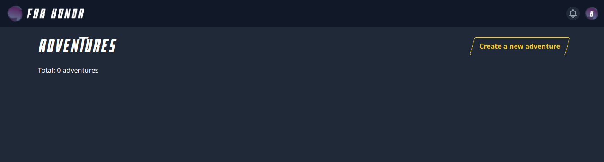
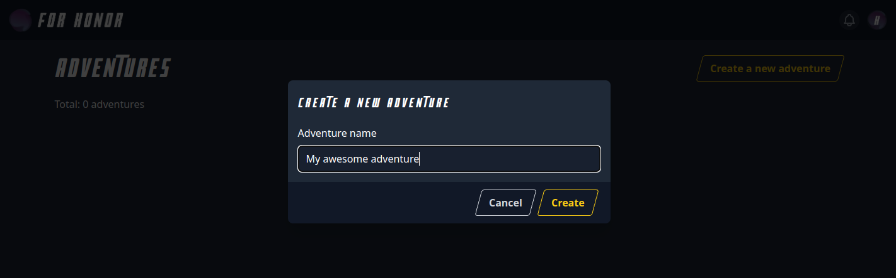
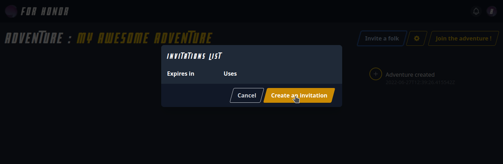
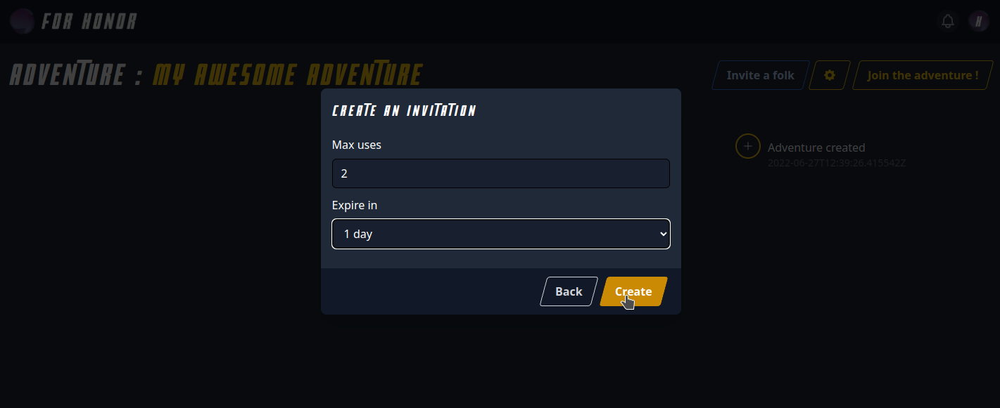
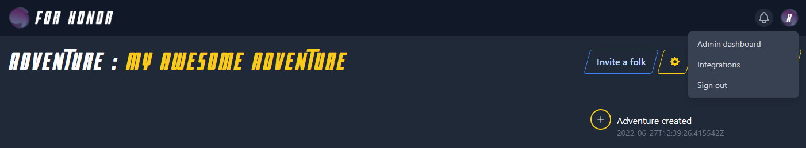
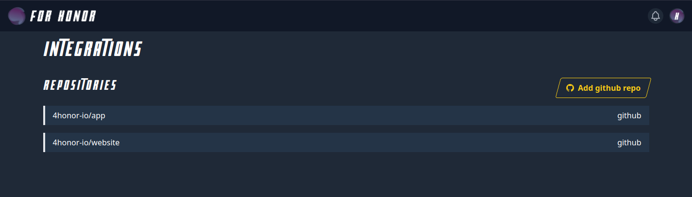
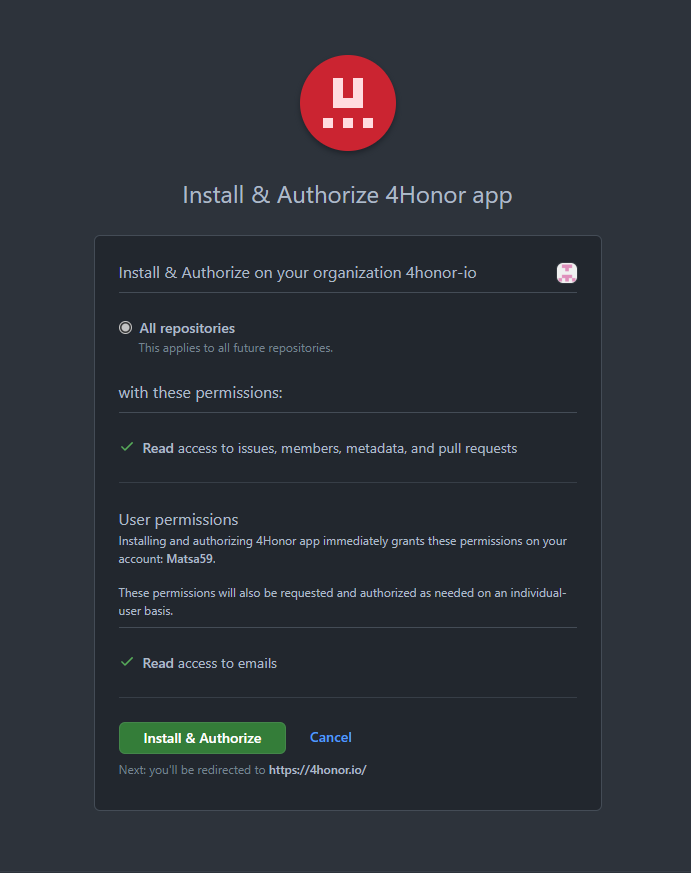
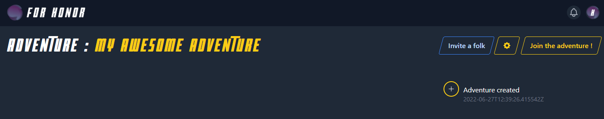
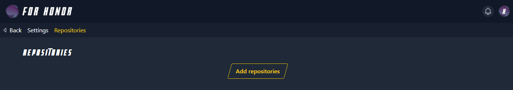
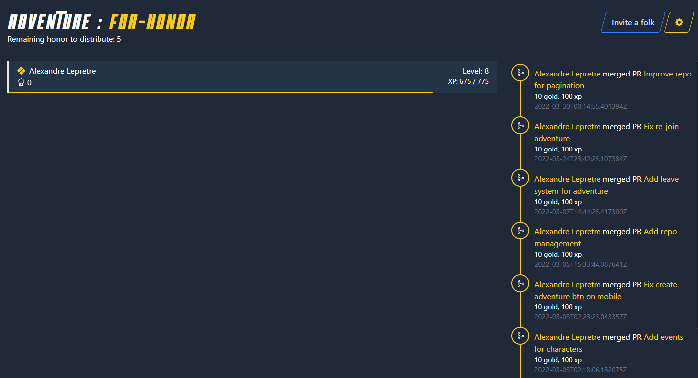

## Create an adventure

To create a new adventure, simply go to the main the
[adventures list](https://4honor.io/adventures) page and click on
"Create a new adventure".

On the modal form, tap the Adventure's name and click **Create**.

Congrats you have created your first adventure!

## Invite your teammates

An adventure without your teammates will not be fun. You could easily invite
them by creating an invite link that you could send using your favorite message
app.

To generate a invite link, create on the button **Invite a folk**
then **Create an invitation**.

Fill the form to match your needs and click on "Create".

Click on **Copy** on send the link to your teammates.

## Link an integration

4Honor by design, could be connected to a lot of tools. The link between 4honor
and other tolls is called an integration.

To link an adventure to an integration, you should first add the integration
to your account on 4Honor. Click on the menu icon (top-right of your browser).

Then click on **Integration**.

On this page, you should see every integrations you have added. If you want to
add your first integration, this list could be empty. The process is the same
for every integrations so, we'll take GitHub as the default integration to
explain the process.

Click on **Add github repo** then on the Github page of the application 4Honor
click on **Configure** and select repository you want to link with 4Honor.

> Linking a repository to 4Honor will not add it to any of your adventures at
> this point. This is only to make it available for 4Honor.

Click on **Install & Authorize** and you should be redirected to 4honor.

## Add an integration to your adventure

Now we have and adventure and we have linked our integration with 4Honor, it's
time to add the integration to our adventure. First go to your adventure page
(in my case, "My awesome adventure"). Click on the "cog" representing the
adventure settings.

Select **Repositories** in the settings navbar.

Select the repository you want to add and voila.

Now, some actions like "merging a PR" or "Approve a PR" will give experience
points to teammates you had invited in your adventure.

here is an example of 4honor with some data:

